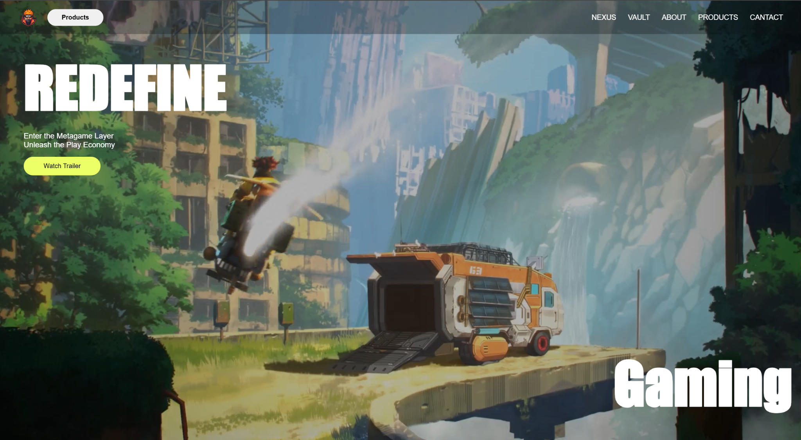

# 🎮 AWWARDS-WEBSITE

🚀 **A Modern Gaming Website built with HTML, CSS, and JavaScript** 🌟  

This project is a **fully developed website** designed to showcase a futuristic gaming experience with a modern UI/UX.  
It features **scroll animations, parallax effects, smooth transitions, and responsive layouts** inspired by Awwwards-winning designs.  

---

## ✨ Features
- 🎨 **Modern UI/UX** with Awwwards-style design  
- ⚡ **Scroll animations** & parallax effects  
- 📱 **Responsive layout** using CSS Grid & Flexbox  
- 🌌 **Dark theme with neon aesthetics**  
- 🎬 **Interactive hover effects & smooth transitions**  
- 🔍 **SEO-friendly & cross-browser optimized**  

---

## 🛠️ Technologies Used
- **HTML5** → Structure  
- **CSS3** → Styling, animations, Flexbox, Grid  
- **JavaScript (ES6)** → Interactivity, smooth scrolling  

---

## 🚀 How to View
1. Clone the repository:
   ```bash
   git clone https://github.com/fsafiya187/AWWARDS-WEBSITE.git
